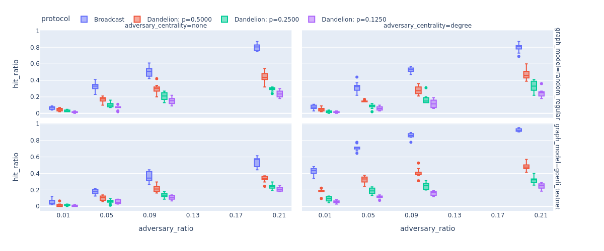

# ethp2psim

[](https://github.com/ferencberes/ethsim/actions/workflows/ubuntu.yml)
[](https://github.com/ferencberes/ethsim/actions/workflows/macos.yml)
[](https://codecov.io/gh/ferencberes/ethp2psim)
[](https://ethp2psim.readthedocs.io/en/latest/?badge=latest)

[](https://mybinder.org/v2/gh/ferencberes/ethp2psim/HEAD?labpath=ipython/EthP2PSimExamples.ipynb)

**ethp2psim** is a network privacy simulator for the Ethereum peer-to-peer (p2p) network. It allows developers and researchers to implement, test, and evaluate the anonymity and privacy guarantees of various routing protocols (e.g., Dandelion(++)) and custom privacy-enhanced message routing protocols. *Issues, PRs, and contributions are welcome!* Let's make Ethereum private together!

## Installation

Create your conda environment:
```bash
conda create -n ethsim python=3.8
```

Activate your environment, then install the package along with requirements:
```bash
conda activate ethsim
pip install .
```

## Tests

Run the following command at the root folder to make sure that your installation was successful:
```bash
pytest --doctest-modules --cov
```

## Quickstart

Here, we show an example of how to simulate the Dandelion protocol in the case of the most basic adversarial setting (predict a node to be the message source if malicious nodes first heard of this message from the given node). You can also experiment with the code below online using [](https://mybinder.org/v2/gh/ferencberes/ethp2psim/HEAD?labpath=EthP2PSimExamples.ipynb).

For reproducibility, **fix a random seed**:

```python
seed = 42
```

### i.) Initialize simulation components
```python
from ethp2psim.network import Network, EdgeWeightGenerator, NodeWeightGenerator
from ethp2psim.protocols import DandelionProtocol
from ethp2psim.adversary import DandelionAdversary
```

First, initialize re-usable **generators for edge and node weights**, e.g. 
   * channel latency is sampled uniformly at random
   * nodes have weights proportional to their staked Ether amount
   
```python
ew_gen = EdgeWeightGenerator("normal", seed=seed)
nw_gen = NodeWeightGenerator("stake", seed=seed)
```

With these generators, let's create a random 20 regular graph with 100 nodes to be the **peer-to-peer (P2P) network** in this experiment:
```python
net = Network(nw_gen, ew_gen, num_nodes=100, k=20, seed=seed)
```

Next, initialize the Dandelion **protocol** where 
   * A message is broadcasted with a 40% probability in the stem (anonymity) phase or further propagated on the line graph with a 60% probability.
   * With the `broadcast_mode="sqrt"` the message is only sent to a randomly selected square root of neighbors in the spreading phase.
   
```python
dp = DandelionProtocol(net, 0.4, broadcast_mode="sqrt", seed=seed)
```

You can easily visualize the line (anonymity) graph for the Dandelion protocol:
```python
import matplotlib.pyplot as plt
nx.draw(dp.anonymity_graph, node_size=20)
```

Finally, initialize a passive **adversary** against the Dandelion protocol that controls a random 10% of all nodes.
```python
adv = DandelionAdversary(dp, 0.1, active=False, seed=seed)
```
You could also use an active adversary (by setting `active=True`) that refuse to propagate received messages.

### ii.) Run simulation

In this experiment, let's **simulate** 20 random messages for the same P2P network and adversary with the Dandelion protocol.

First, initialize the simulator by setting the protocol, the adversary, the number of simulated messages, and how the message source nodes are sampled.
```python
from ethp2psim.simulator import Simulator
sim = Simulator(adv, num_msg=20, use_node_weights=True, verbose=False, seed=seed)
```
Due to the `use_node_weights=True` setting, source nodes for messages are randomly sampled with respect to their staked Ether amount in accordance with the formerly prepared `NodeWeightGenerator`.

Next, run the simulation:
```python
sim.run()
```

### iii.) Evaluate the simulation

**Evaluate** the performance of the adversary for the given simulation. Here, you can choose different estimators for adversary performance evaluation (e.g., "first_sent", "first_reach", "dummy"):
```python
from ethp2psim.simulator import Evaluator
evaluator = Evaluator(sim, estimator="first_sent")
print(evaluator.get_report())
```

For more information on usage and experiments in the [documentation](https://ethp2psim.readthedocs.io/en/latest/?badge=latest).

## Motivation

To highlight the potential in our simulator, we show the average fraction of messages (y-axis) deanomyzed by the adversary with respect to different factors:

* the fraction of P2P network nodes controlled by the adversary (x-axis)
* whether adversarial nodes are selected uniformly at random, or they control nodes with the highest degrees (see figure columns)
* the network model (see figure rows) used to simulate the Ethereum P2P network (random regular with 1000 nodes vs. Goerli testnet with approximately 1500 nodes) 



The results show that using Dandelion(++) the adversary significantly loses from its deanonymization power compared to the case when only simple Broadcasting is used for message propagation. The results are even more promising for [our Onion Routing based protocol](https://info.ilab.sztaki.hu/~kdomokos/OnionRoutingP2PEthereumPrivacy.pdf) ([related documentation](https://ethp2psim.readthedocs.io/en/latest/onion_routing.html)) that is affected less by the ratio of adversarial nodes in the P2P network.

Furthermore, as the bottom-right figure shows, for the real-world Goerli testnet data and high-degree adversarial nodes the simple broadcasting would be a very bad choice as the adversary can easily predict the originator for more than 50% of the messages.

You can find more interesting experiments in the [documentation](https://ethp2psim.readthedocs.io/en/latest/experiments.html).

## Useful resources

- Our [detailed summary](ethp2psim_summary.pdf) for this project.
- [Documentation](https://ethp2psim.readthedocs.io/en/latest/) of the source code with several examples and a few experimental results.
- The [manuscript](https://info.ilab.sztaki.hu/~kdomokos/OnionRoutingP2PEthereumPrivacy.pdf) of our proposed onion routing based protocol.

## Acknowledgements

The development of this simulator and [our research](https://info.ilab.sztaki.hu/~kdomokos/OnionRoutingP2PEthereumPrivacy.pdf) was funded by the Ethereum Foundation's [Academic Grant Rounds 2022](https://blog.ethereum.org/2022/07/29/academic-grants-grantee-announce). 
Thank you for your generous support!