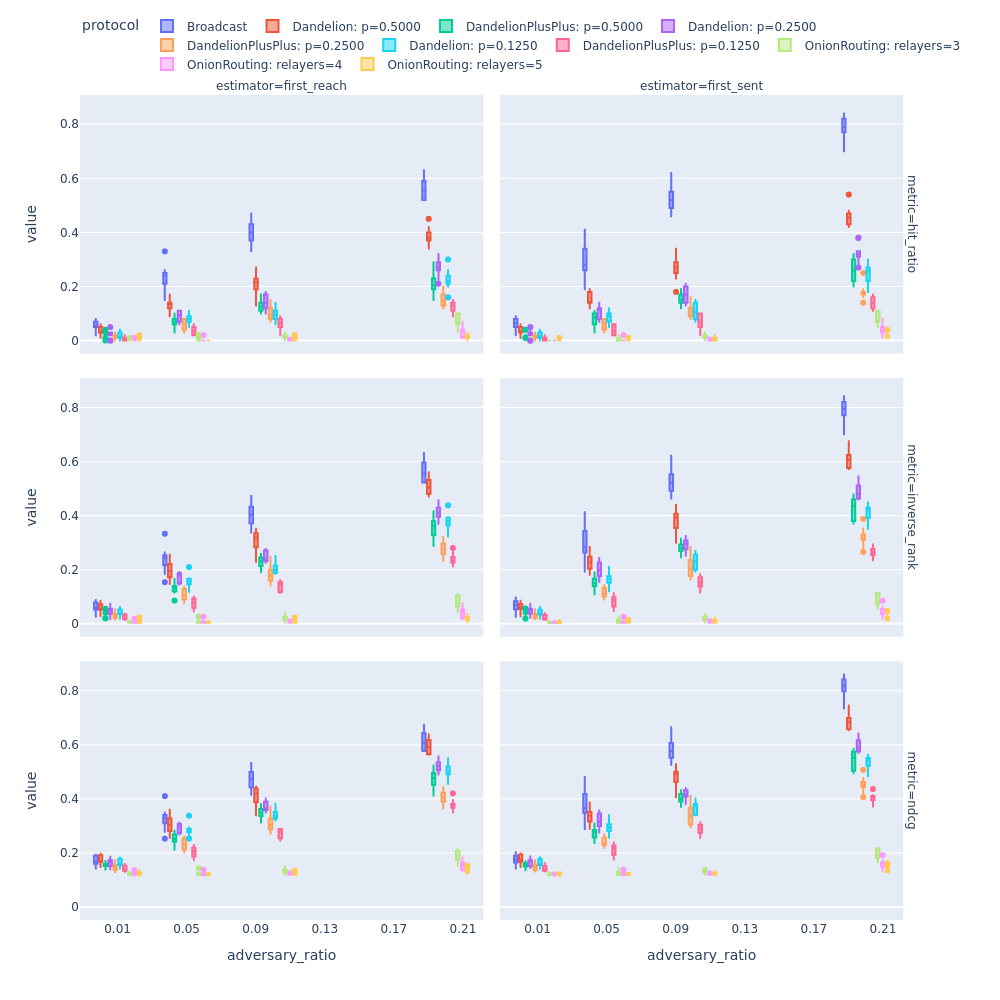
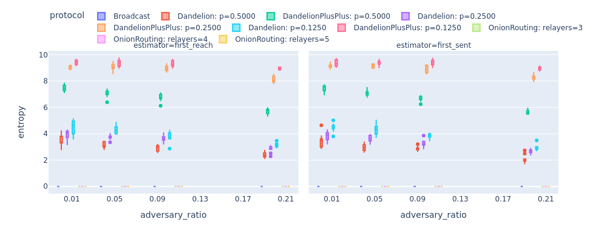
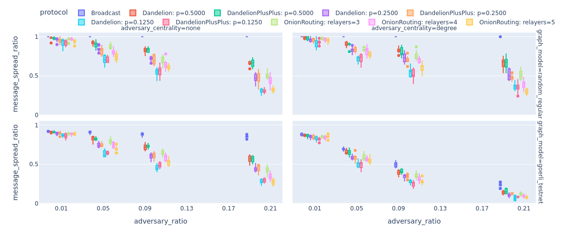

Experimental results with various protocols
===========================================

Here, we show some of our results that we achieved by running the simulator with various different parameters. But first, let's discover the tools that we prepared for you to help your experimentation with our package.

Resources for running experiments
---------------------------------

If you want to compare how well the adversary can deanonymize message sources for the :class:`protocols.BroadcastProtocol` and the :class:`protocols.DandelionProtocol` then we recommend you to use our  `Bash script <https://github.com/ferencberes/ethp2psim/blob/main/scripts/run_experiments.sh>`_. that have three parameters:

#. The number of independent trials to use to gain insights. The mean deanonymization performance of the adversary will be reported with respect to these trials. Basically, the number of trials represents the number of different network and adversary settings in the experiment. In each setting, we simulate multiple messages (approximately 10% of the P2P nodes) over a fixed network and a fixed set of adversarial nodes.
#. The size of the P2P :class:`network.Network` to simulate. If you set 0, then the script will load the :class:`data.GoerliTestnet`.
#. Specify a centrality measure (e.g., degree, pagerank or betweenness) to measure the :class:`adversary.Adversary` performance when it controls the most central nodes of the network.

For example, run the following commands in parallel to save some execution time:

.. code-block:: bash

  bash run_experiments.sh 10 1000
  bash run_experiments.sh 10 0
  bash run_experiments.sh 10 1000 degree
  bash run_experiments.sh 10 0 degree

This way you will be able to compare results based on 10 trials for a random regular graph with 1000 nodes and 50 degree and the underlying graph of the Goerli (Görli) testnet. Adversary performance will be evaluated for both highest degree and uniform random node sampling settings.

A few interesting simulation results
------------------------------------

In the following, we include some fascinating simulation results produced by ethp2psim. You can create similar and more advanced measurements using this tool. The following examples might serve as some inspiration what you can build using this tool. Let's analyze some of the privacy-enhancing routing algorithms in various networks and adversarial settings!

A discussion on performance metrics
~~~~~~~~~~~~~~~~~~~~~~~~~~~~~~~~~~~

First, let's start with a simple experiment where we compare the deanonymization power of the adversary when it uses the first-reach or the first-sent heuristics to determine the source of each message. These estimator strategies are used to guess the first node that broadcasted a given message based on the observations of all adversarial nodes. In short, an adversary using the first-reach heuristic predicts a node to be the first broadcaster if it is the first node that it heard the message from. On the other hand, using channel latency information, a first-sent estimator tries to identify the neighbor that first sent the message to any of the adversarial nodes. Naturally, the two predictions might not coinside as the triangle inequality does not necessarily hold for P2P network latency.

In this experiment, we use a random regular graph with 1000 nodes and 50 degree to compare the two heuristics against simple :class:`protocols.BroadcastProtocol` and :class:`protocols.DandelionProtocol`. Not surprisingly, our results show that the adversary with the first-sent estimator performs significantly better. However, we highlight that only the hit ratio, inverse rank and NDCG can reflect this behavior where ground truth information about message sources is compiled into the evaluation.    

Unfortunately, entropy does not work this way. It only measures the uncertainty of the prediction but not its goodness.

It is interesting to see how Dandelion can confuse the adversary compared to simple broadcasting in terms of hit ratio (e.g., first-sent performance drops from 0.5 to 0.3 in case of 10% adversarial nodes) which might indicate that it is an overly ambitious performance metric. Instead, **our recommendation is to use inverse rank or NDCG for evaluation**. These metrics can better reflect that despite the higher uncertainty introduced by Dandelion(++) the adversary can still make a good educated guess in knowledge of the anonymity graph. For example, it is quite shocking to see the change in inverse from 0.5 to 0.4, that is only 0.5 worse ranks on average for the predicted message source, in case of 10% adversarial nodes. 

Comparing different network topologies
~~~~~~~~~~~~~~~~~~~~~~~~~~~~~~~~~~~~~~
.. _topology_results:

In the Figure below, we observe how different graph topologies (random regular graph and a scale-free graph (Görli testnet's topology)) affects the adversary's deanonymization power measured by various different metrics (e.g., hit ratio, inverse rank, NDCG). The deanonymization performance is displayed with respect to the ratio of adversarial nodes (see the x-axis) in the P2P network.

Here, we make three main observations related to privacy:

#. Dandelion with the least forwarding probability provides the highest privacy among the considered protocols. 
#. In general the Görli testnet provides more privacy across all metrics. 
#. The achieved privacy is quite brittle in case of 0.2 adversary ratio: 0.5 inverse_rank for Dandelion means that the adversary outputs a vector of candidates and on average the true originator is put to the 2nd place.

..  figure:: ../../figures/graph_model_comparision.png

Furthermore, we measure the percentage of nodes reached by a message in general. The last row of this Figure shows that approximately 8% of Görli testnet nodes do not see all the broadcasted messages. We could attribute this phenomena to the hub and spoke structure of the Görli testnet. Basically, some nodes in the spoke part of the network might not see all the broadcasted messages.

Broadcast settings
~~~~~~~~~~~~~~~~~~

Next, observe the significant change in the results when a message is propagated to all neighbors, instead :ref:`a random square root of them <topology_results>`, during the broadcast phase. It is quite shocking that an adversary controling 10% of all nodes can be almost sure about the identity of the message source in case of simple :class:`protocols.BroadcastProtocol`. Clearly, Dandelion can significantly decrease the deanonymization performance of the adversary but it has a high price in terms of robustness detailed in the next section.

..  figure:: ../../figures/broadcast_mode_inverse_rank.png

Robustness for active and passive adversary
~~~~~~~~~~~~~~~~~~~~~~~~~~~~~~~~~~~~~~~~~~~

    In our next experiment, we consider two types of adversaries. A passive adversary follows the protocol and only logs the timestamp information when its nodes encounter messages. However, an active adversary on top of logging information, does not forward incoming messages. Invthe next Figure, we show that this is especially problematic for Dandelion(++). Imagine that an active adversary sits in the stem (anonymity) phase of Dandelion(++). In this case, the message will be never broadcasted. The more and more adversaries censor messages the larger the portion of messages that are not heard by nodes in the P2P network. This is even more concerning, when the high-degree nodes are compromised (e.g., adversary_centrality='degree'). Note that the random regular graph is more robust against (active) adversaries.

    In the next Figure, once again, we see the low levels of privacy (measured in inverse_rank in this figure) provided by various privacy-enhanced routing algorithms. It is easy to consider that in our setting active and passive adversaries have the same power to deanonymize  messsage. Deanonymization results are slightly better for the Görli testnet's topology, i.e., the adversary is less powerful on a scale-free graph. In our experiments, the random regular graph has a higher edge density, hence, the adversary can make a more informed guess about the originator of the messages.

How to visualize results?
-------------------------

In our Github repository, we published the `notebook <https://github.com/ferencberes/ethp2psim/blob/main/Results.ipynb>`_ that we used to visualize the results. We hope that it also helps you to visualize your finding.