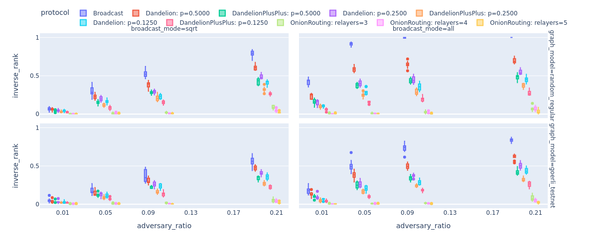
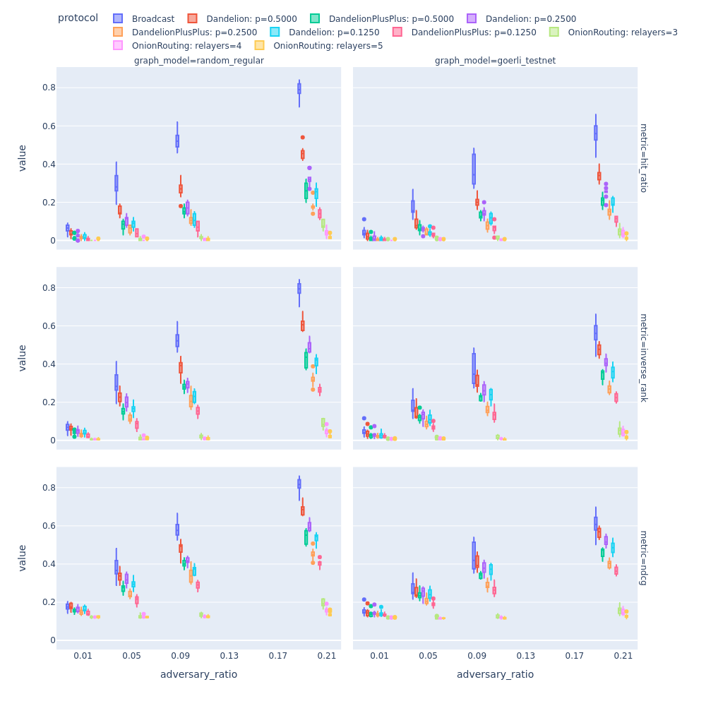

Experimental results
====================

Here, we how some of our results that we achieved by running the simulator with various different parameters. But first, let's discover all the tools that we prepared for you to help your experimentation with our package.

Resources for running experiments
---------------------------------

If you want to compare how well the adversary can deanonymize message sources for the :class:`protocols.BroadcastProtocol` and the :class:`protocols.DandelionProtocol` then we recommend you to use our  `Bash script <https://github.com/ferencberes/ethp2psim/blob/main/scripts/run_experiments.sh>`_. that have three parameters:

#. The number of independent trials to use to gain insights. The mean deanonymization performance of the adversary will be reported for these trials.
#. The size of the P2P :class:`network.Network` to simulate. If you set 0, then the script will load the :class:`data.GoerliTestnet`.
#. Specify a centrality measure (e.g., degree, pagerank or betweenness) to measure the :class:`adversary.Adversary` performance when it controls the most central nodes of the network.

For example, run the following commands in parallel to save some execution time:

.. code-block:: bash

bash run_experiments.sh 10 1000
bash run_experiments.sh 10 0
bash run_experiments.sh 10 1000 degree
bash run_experiments.sh 10 0 degree

This way you will be able to compare results based on 10 trials for a random regular graph with 1000 nodes and 50 degree and the underlying graph of the Goerli testnet. Adversary performance will be evaluated for both highest degree and uniform random node sampling settings.

How to visualize results?
-------------------------

We also prepared a  `notebook <https://github.com/ferencberes/ethp2psim/blob/main/Results.ipynb>`_ that you can use to visualie the results.

A few interesting simulation results
------------------------------------

In the following, we include some fascinating simulation results produced by ethp2psim. You can create similar and more advanced measurements using this tool. The following examples might serve as some inspiration what you can build using this tool. Let's analyze some of the privacy-enhancing routing algorithms in various networks and adversarial settings!

    On the x-axis we display the percentage of adversarial nodes, while on the y-axis you can see a metric to measure the deanonymization capabilities of the adversary (see a more detailed explanation later). We simulated the experiments on two different graph topologies: a random regular graph and a snapshot obtained from the Görli testnet (which is presumably a scale-free network). We can make three main observations here. First, Dandelion with the least forwarding probability provides the highest privacy among the considered protocols. Second, in general the Görli testnet's topology is better than a random regular graph from a privacy point of view. Third, the achieved privacy is quite brittle: 0.5 inverse_rank means that the adversary outputs a vector of candidates and on average the adversary puts the true originator on the 2nd place.

    In this Figure, we observe how different graph topologies (random regular graph and a scale-free graph (Görli testnet's topology)) affects the adversary's deanonymization power measured by inverse_rank, hit_ratio and ndcg. We find that Görli testnet provides more privacy across all metrics. We also measure the percentage of users that see a broadcasted message. In the last row of this figure, one can see that a handful of nodes do not see all the broadcasted messages in case of the scale-free graph. We could attribute this phenomena to the hub and spoke structure of the Görli testnet. Some nodes in the spoke part of the network might not see all the broadcasted messages.

    