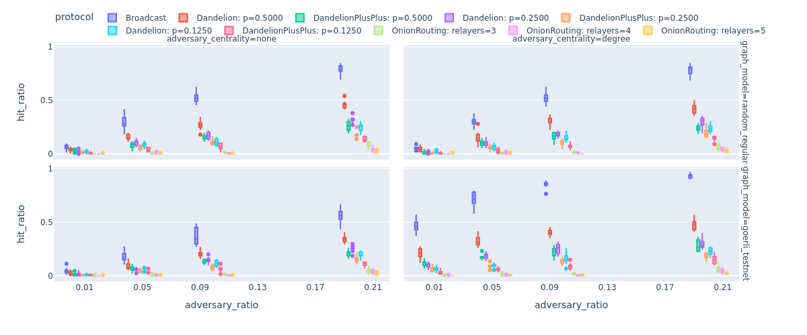

.. ethsim documentation master file, created by
   sphinx-quickstart on Fri Nov 18 09:29:11 2022.
   You can adapt this file completely to your liking, but it should at least
   contain the root `toctree` directive.

Welcome to ethp2psim's documentation!
=====================================

**ethp2psim** is a network privacy simulator for the Ethereum peer-to-peer (P2P) network. It allows developers and researchers to implement, test, and evaluate the anonymity and privacy guarantees of various routing protocols (e.g., simple broadcasting, Dandelion(++)) and custom privacy-enhanced message routing protocols. Issues, PRs, and contributions are welcome! Let's make Ethereum private together!

In this Python package, we release our modular Ethereum P2P transaction simulator to help better understand and compare different message-passing protocols in different adversarial settings. Our simulator has the following major components that you can use to build up complex simulations or to implement your own message-passing protocol:

#. The underlying **peer-to-peer (P2P) network** that is used for message propagation. A message can be a block proposal, an attestation or a simple transaction. By default, we use random regular graphs to simulate the Ethereum P2P network, but custom datasets or graphs can be easily integrated as well. For details, see the :ref:`network_sect` section.

#. The **protocol** defines the exact rules for message propagation. In the :ref:`protocols_sect` section, we introduce several baseline protocols that are implemented in our package. Furthermore, we propose an Onion Routing based protocol that has the potential to prevent any single party from linking the IP address and public key of the originator, if executed successfully. For more details, check out our work: :ref:`onion_sect`.

#. The **adversary** is constantly eavesdropping on network traffic by controlling a subset of the P2P network nodes. Its main goal is to predict the source node (the originator) for each message. In the :ref:`adversary_sect` section, we demonstrate various ways to configure your adversary.

Follow the :doc:`quickstart` for some introductory examples on how to merge these components into a simulation!

Motivation
----------

To highlight the potential in our simulator, we show the average fraction of messages (y-axis) deanomyzed by the adversary with respect to different factors:

* i.) the fraction of P2P network nodes controlled by the adversary (x-axis)
* ii.) whether adversarial nodes are selected uniformly at random, or they control nodes with the highest degrees (see figure columns)
* iii.) the network model (see figure rows) used to simulate the Ethereum P2P network (random regular with 1000 nodes vs. Goerli testnet with approximately 1500 nodes) 
   

The results show that using Dandelion(++) the adversary significantly loses from its deanonymization power compared to the case when only simple Broadcasting is used for message propagation. The results are even more promising for :class:`ethp2psim.protocols.OnionRoutingProtocol` that is affected less by the ratio of adversarial nodes in the P2P network.

Furthermore, as the bottom-right figure shows, for the real-world Goerli testnet data and high-degree adversarial nodes the simple broadcasting would be a very bad choice as the adversary can easily predict the originator for more than 50% of the messages.

You can find more interesting experiments in the :ref:`experiment_sect` section.

Acknowledgements
----------------

The development of `this simulator <https://github.com/ferencberes/ethp2psim>`_ and `our research <https://info.ilab.sztaki.hu/~kdomokos/OnionRoutingP2PEthereumPrivacy.pdf>`_ was funded by the Ethereum Foundation's `Academic Grant Rounds 2022 <https://blog.ethereum.org/2022/07/29/academic-grants-grantee-announce>`_. 
Thank you for your generous support!

.. toctree::
   :maxdepth: 2
   :caption: Contents:
   
   quickstart
   network
   message_and_protocols
   adversary
   simulator
   onion_routing
   experiments
   contributions
   

Indices
=======

* :ref:`genindex`
